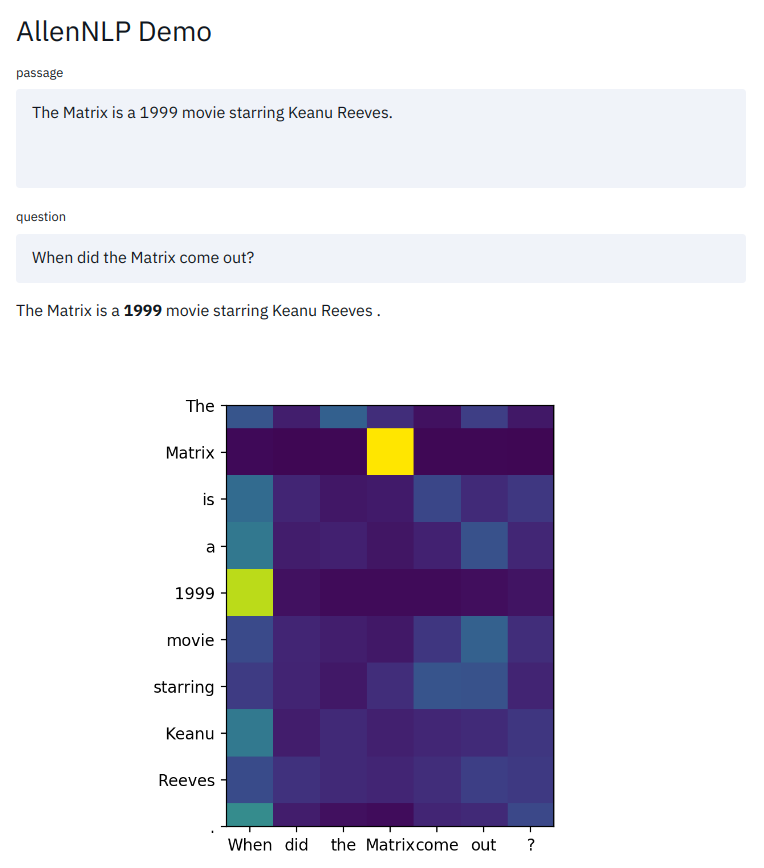

# AllenNLP + Streamlit Demo

This is a simple example of how to use [Streamlit](https://streamlit.io)
to create an interactive demo for an [AllenNLP](https://allennlp.org) model.
In particular, this demonstrates the
[BiDAF](https://demo.allennlp.org/reading-comprehension) model for question answering,
trained on the [SQuAD](https://rajpurkar.github.io/SQuAD-explorer/) dataset.



## How to run this demo

```
pip install -r requirements.txt
streamlit run app.py
```

Go to http://localhost:8501, and try your own examples.
